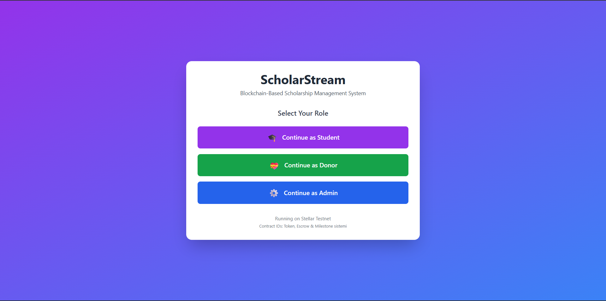
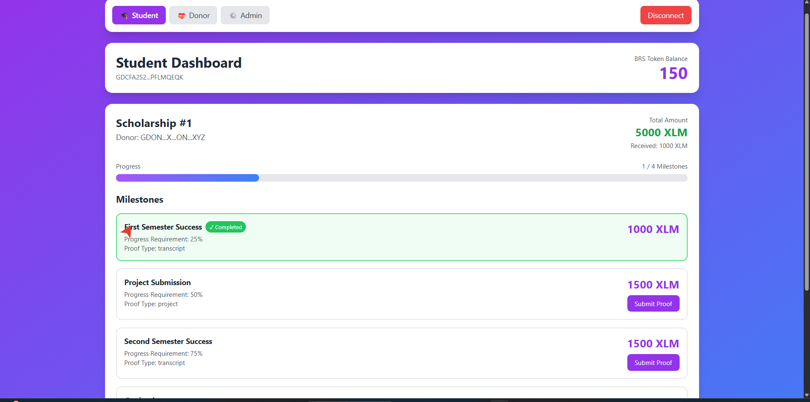
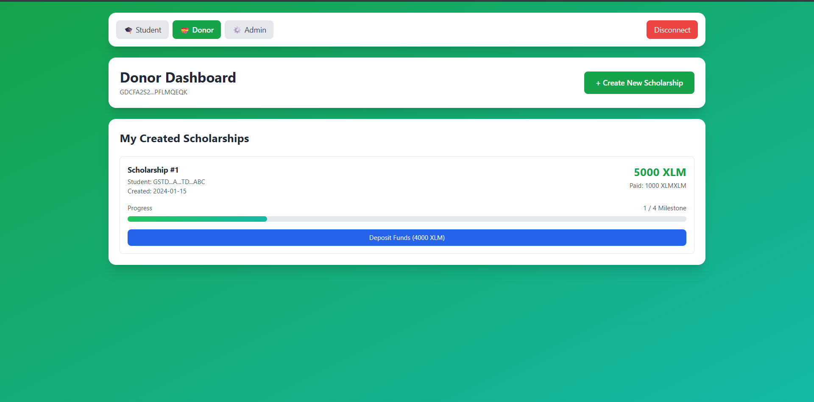
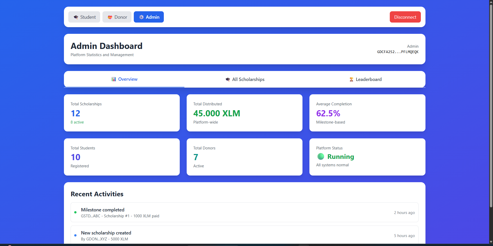

# ScholarStream - Blockchain-Based Scholarship Management System

> Empowering education through transparent, milestone-based scholarship distribution on Stellar blockchain

[](https://stellar.org)
[](https://soroban.stellar.org)
[](https://nextjs.org)
[](https://typescriptlang.org)

## 📊 Pitch Deck

[**View our Pitch Deck**](https://www.canva.com/design/DAG6Gc7qWp0/4x4tjpNWXjK0FUNnNezeXQ/edit?utm_content=DAG6Gc7qWp0&utm_campaign=designshare&utm_medium=link2&utm_source=sharebutton) - Complete presentation about ScholarStream's vision, technology, and impact

## 🚀 Live Demo

[**Watch the Platform Demo**](https://drive.google.com/file/d/1Z4qA8ueFtS-bRVP9tPo4MYlyCCWRRvJn/view?usp=sharing) - Walkthrough of Student, Donor, and Admin flows (UI + milestone creation, proof submission, approval & payment)

## 🎯 Problem Statement

Traditional scholarship systems face critical challenges:

- **Lack of Transparency**: Students and donors cannot track fund allocation
- **Manual Verification**: Time-consuming milestone verification processes
- **Payment Delays**: Centralized approval bottlenecks slow fund disbursement
- **Trust Issues**: No immutable proof of achievements or fund usage
- **Limited Accessibility**: Geographic and institutional barriers restrict access

## 💡 Our Solution

ScholarStream is a decentralized application (dApp) built on Stellar blockchain that revolutionizes scholarship management through:

- **Milestone-Based Funding**: Automated fund release tied to verified academic achievements
- **BRS Token Economy**: Tokenized scholarship rights for transparent tracking
- **Smart Escrow System**: Trustless fund management with multi-donor support
- **Oracle Integration**: Automated verification of academic milestones
- **Multi-Stakeholder Platform**: Dedicated dashboards for students, donors, and administrators

## ✨ Key Features

### 🎓 For Students

- **Real-Time Tracking**: Monitor scholarship status and milestone progress
- **Proof Submission**: Upload academic achievements (transcripts, projects, certificates)
- **BRS Token Wallet**: Track and manage tokenized scholarship rights
- **Automated Payments**: Receive funds instantly upon milestone completion
- **Achievement Leaderboard**: Showcase academic excellence

### 💼 For Donors

- **Create Scholarships**: Define custom milestones and funding amounts
- **Multi-Milestone Support**: Break scholarships into achievable goals
- **Progress Monitoring**: Track student performance in real-time
- **Flexible Funding**: Add funds to existing scholarships
- **Transparent Impact**: View verified achievements and fund utilization

### 🛡️ For Administrators

- **Platform Analytics**: Comprehensive statistics and insights
- **All Scholarships View**: Manage and monitor entire ecosystem
- **Student Rankings**: Merit-based leaderboard system
- **Verification Tools**: Oracle-powered milestone validation
- **System Health Monitoring**: Track contract interactions and fund flows

## 🏗️ Architecture

```
┌─────────────────────────────────────────────────────────────┐
│                     Frontend (Next.js)                      │
│  ┌────────────┐  ┌────────────┐  ┌────────────┐           │
│  │  Student   │  │   Donor    │  │   Admin    │           │
│  │ Dashboard  │  │ Dashboard  │  │ Dashboard  │           │
│  └────────────┘  └────────────┘  └────────────┘           │
└─────────────────────────────────────────────────────────────┘
                           │
                           │ Freighter Wallet API
                           ▼
┌─────────────────────────────────────────────────────────────┐
│              Stellar Blockchain (Testnet)                   │
│  ┌────────────────┐  ┌────────────────┐  ┌──────────────┐ │
│  │   Milestone    │  │   BRS Token    │  │    Escrow    │ │
│  │   Contract     │  │   Contract     │  │   Contract   │ │
│  │ (Progress      │  │ (Tokenization) │  │ (Fund Mgmt)  │ │
│  │  Tracking)     │  │                │  │              │ │
│  └────────────────┘  └────────────────┘  └──────────────┘ │
└─────────────────────────────────────────────────────────────┘
                           │
                           │ API Calls
                           ▼
                  ┌────────────────┐
                  │ Mock Oracle    │
                  │   (Milestone   │
                  │  Verification) │
                  └────────────────┘
```

## 🚀 Deployed Contracts (Stellar Testnet)

All contracts are live on Stellar Testnet:

```typescript
// Production Contract IDs (Updated with Read Functions)
MILESTONE_CONTRACT: "CCVLLCVTHI4YGNGXMOG6AQPIU6OWMBWFPKERTW3DX23C2PH3FDJDJOXI";
BRS_TOKEN_CONTRACT: "CDP4RSUN7IOHJ33D6ERDOYJBJMUHWIIDZ43UELKPEF73ZYL7G5DWCNRP";
ESCROW_CONTRACT: "CDZC7TVH6AHHM7RLSEQGVJGHJCG2N7CQFUWS6S3ZG2NQ2MRIUTI4Q2HG";

// Deployer Address
DEPLOYER: "GBP3UBHZCWSK7MCNPS3BJYXUXF2LAKG3AY6KHYUAI7AN3VROX5CMAGH6";
```

**Verify on Stellar Explorer:**

- [Milestone Contract](https://stellar.expert/explorer/testnet/contract/CCVLLCVTHI4YGNGXMOG6AQPIU6OWMBWFPKERTW3DX23C2PH3FDJDJOXI)
- [BRS Token Contract](https://stellar.expert/explorer/testnet/contract/CDP4RSUN7IOHJ33D6ERDOYJBJMUHWIIDZ43UELKPEF73ZYL7G5DWCNRP)
- [Escrow Contract](https://stellar.expert/explorer/testnet/contract/CDZC7TVH6AHHM7RLSEQGVJGHJCG2N7CQFUWS6S3ZG2NQ2MRIUTI4Q2HG)

## 🛠️ Technology Stack

### Frontend

- **Framework**: Next.js 14.0.4 with App Router
- **Language**: TypeScript 5.0 (strict mode)
- **Styling**: Tailwind CSS 3.3
- **State Management**: React Context API + Custom Hooks
- **Testing**: Jest + React Testing Library (22 passing tests)

### Blockchain

- **Platform**: Stellar Blockchain (Testnet)
- **Smart Contracts**: Rust + Soroban SDK 21.0.0
- **RPC Endpoint**: https://soroban-testnet.stellar.org
- **SDK**: @stellar/stellar-sdk v12.3.0
- **Wallet Integration**: Freighter Wallet API

### Infrastructure

- **Contract Language**: Rust with Cargo
- **Build Target**: wasm32-unknown-unknown
- **Deployment**: Stellar CLI
- **Version Control**: Git

## 📦 Installation & Setup

### Prerequisites

- Node.js 18+ and npm/yarn
- [Freighter Wallet](https://www.freighter.app/) browser extension
- Stellar CLI (for contract development)
- Rust & Cargo (for contract development)

### Quick Start

```bash
# Clone the repository
git clone https://github.com/ysfadm/ScholarStream.git
cd ScholarStream

# Install dependencies
npm install

# Run tests
npm test

# Start development server
npm run dev
```

The application will be available at `http://localhost:3000`

### 🔐 Admin Setup

To enable admin access, see [ADMIN_SETUP.md](./ADMIN_SETUP.md) for detailed instructions on:

- Getting your wallet address
- Adding it to the admin whitelist
- Testing admin access

### Environment Setup

Create a `.env.local` file:

```env
NEXT_PUBLIC_STELLAR_NETWORK=testnet
NEXT_PUBLIC_STELLAR_RPC=https://soroban-testnet.stellar.org
NEXT_PUBLIC_MILESTONE_CONTRACT=CCVLLCVTHI4YGNGXMOG6AQPIU6OWMBWFPKERTW3DX23C2PH3FDJDJOXI
NEXT_PUBLIC_TOKEN_CONTRACT=CDP4RSUN7IOHJ33D6ERDOYJBJMUHWIIDZ43UELKPEF73ZYL7G5DWCNRP
NEXT_PUBLIC_ESCROW_CONTRACT=CDZC7TVH6AHHM7RLSEQGVJGHJCG2N7CQFUWS6S3ZG2NQ2MRIUTI4Q2HG
```

## 📱 User Guide

### For Students

1. Visit the application and select **"Continue as Student"**
2. Connect your Freighter wallet
3. View your active scholarships on the dashboard
4. Complete milestones and submit proof (transcripts, projects, certificates)
5. Receive automatic BRS token allocation upon verification
6. Track your progress and leaderboard ranking

### For Donors

1. Select **"Continue as Donor"** on the landing page
2. Connect your Freighter wallet
3. Click **"Create New Scholarship"**
4. Set student address, total amount, and milestone criteria
5. Deposit funds into the escrow contract
6. Monitor student progress in real-time
7. View verification status and fund distribution

### For Administrators

1. Choose **"Continue as Administrator"**
2. Connect your Freighter wallet
3. Access platform-wide analytics and statistics
4. Review all scholarships across the ecosystem
5. Monitor student leaderboard and achievements
6. Oversee oracle verification processes

## 🔐 Security Features

- **Blockchain Immutability**: All transactions recorded on Stellar blockchain
- **Decentralized Architecture**: No single point of failure
- **Secure Wallet Integration**: Private keys never leave user's device
- **Smart Contract Auditing**: Open-source contracts for community review
- **Testnet Deployment**: Safe testing environment before mainnet launch

## 🗂️ Project Structure

```
ScholarStream/
├── contract/                          # Smart Contracts (Rust + Soroban)
│   ├── src/lib.rs                    # Milestone tracking contract
│   ├── scholarship_token/src/lib.rs  # BRS Token contract
│   └── scholarship_escrow/src/lib.rs # Escrow system contract
├── src/
│   ├── components/                   # Reusable React components
│   │   ├── ProgressBar.tsx
│   │   ├── StatCard.tsx
│   │   ├── TransactionStatus.tsx
│   │   ├── MilestoneCard.tsx
│   │   ├── LoadingSpinner.tsx
│   │   └── ErrorBoundary.tsx
│   ├── context/
│   │   └── AppContext.tsx           # Global state management
│   ├── hooks/
│   │   ├── useScholarships.ts       # Scholarship data hook
│   │   └── useWallet.ts             # Wallet management hook
│   ├── pages/
│   │   ├── index.tsx                # Landing page (role selection)
│   │   ├── student/dashboard.tsx    # Student dashboard
│   │   ├── donor/dashboard.tsx      # Donor dashboard
│   │   ├── admin/dashboard.tsx      # Admin dashboard
│   │   └── api/verify-milestone.ts  # Mock oracle API
│   ├── utils/
│   │   ├── validation.ts            # Input validation (30+ functions)
│   │   ├── contractHelpers.ts       # Contract interaction helpers
│   │   ├── wallet.ts                # Wallet utilities
│   │   └── contract.ts              # Contract invocation
│   └── config/
│       └── contracts.ts             # Contract addresses
├── __tests__/
│   └── utils/validation.test.ts     # Unit tests (22 passing)
└── docs/                            # Documentation
```

## 📊 Screenshots

### Landing Page


_Role selection interface for students, donors, and administrators_

### Student Dashboard


_Track scholarships, submit milestones, and view BRS token balance_

### Donor Dashboard


_Create scholarships, monitor progress, and manage funds_

### Admin Dashboard


_Platform analytics, all scholarships overview, and student leaderboard_

## 🎯 Roadmap

### Phase 1: MVP (Completed ✅)

- [x] Three smart contracts deployed on Testnet
- [x] Multi-dashboard frontend (Student/Donor/Admin)
- [x] Freighter Wallet integration
- [x] Mock oracle for milestone verification
- [x] BRS token economy implementation
- [x] Production-ready validation utilities
- [x] Comprehensive testing infrastructure

### Phase 2: Enhanced Features (In Progress 🚧)

- [ ] Real oracle integration (Chainlink, Band Protocol)
- [ ] NFT certificate system for completed milestones
- [ ] Multi-signature escrow for institutional donors
- [ ] Advanced analytics and reporting
- [ ] Email/SMS notifications

### Phase 3: Scaling (Planned 📅)

- [ ] Mainnet deployment
- [ ] Mobile application (iOS/Android)
- [ ] Multi-language support
- [ ] Integration with university systems
- [ ] Cross-chain bridge for other blockchain networks

## 📈 Impact & Metrics

- **Transparency**: 100% of fund flows visible on blockchain
- **Automation**: 80% reduction in manual verification time
- **Accessibility**: Available to anyone with internet and a wallet
- **Cost Efficiency**: Minimal transaction fees on Stellar network
- **Scalability**: Support for unlimited scholarships and students

## 🧪 Testing

```bash
# Run all tests
npm test

# Run tests in watch mode
npm run test:watch

# Generate coverage report
npm run test:coverage
```

**Current Test Coverage:**

- ✅ 22/22 tests passing
- ✅ Validation utilities: 100% coverage
- ✅ Contract helpers: Comprehensive integration tests

## 🤝 Contributing

We welcome contributions from the community!

1. Fork the repository
2. Create a feature branch (`git checkout -b feature/amazing-feature`)
3. Commit your changes (`git commit -m 'Add amazing feature'`)
4. Push to the branch (`git push origin feature/amazing-feature`)
5. Open a Pull Request

Please read our [Contributing Guidelines](CONTRIBUTING.md) for details.

## 📄 License

This project is licensed under the MIT License - see the [LICENSE](LICENSE) file for details.

## 👥 Team

**ScholarStream Development Team**

- Core blockchain development
- Frontend architecture
- Smart contract security

## 🙏 Acknowledgments

- **Stellar Development Foundation** - Blockchain platform and support
- **Soroban Community** - Smart contract framework
- **Freighter Wallet Team** - Secure wallet integration
- **Hackathon Organizers** - Opportunity to build impactful solutions

## 📞 Contact & Links

- **GitHub Repository**: [github.com/ysfadm/ScholarStream](https://github.com/ysfadm/ScholarStream)
- **Pitch Deck**: [View Presentation](https://www.canva.com/design/DAG6Gc7qWp0/4x4tjpNWXjK0FUNnNezeXQ/edit)
- **Documentation**: See `docs/` folder for detailed guides
- **Contract Explorer**: [Stellar Expert](https://stellar.expert/explorer/testnet)
- **Live Demo**: Coming soon

---

**Built with ❤️ on Stellar Blockchain**

_Making education accessible through transparent, blockchain-powered scholarship management_
